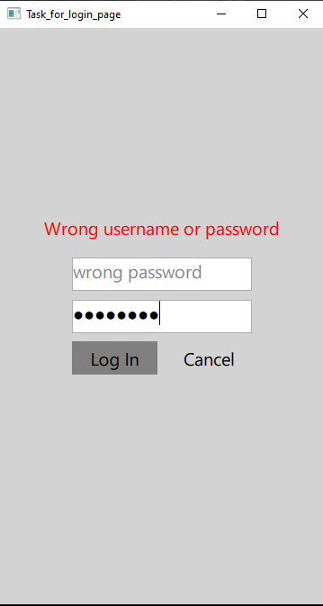

# Задание 1

## Компоненты

- [main.qml](main.qml)
- [My_Page.qml](My_Page.qml)

## Результат

Начальная страница

Ошибка авторизации

Успешная авторизация

--------------------------------------

# Задание 2

## Компоненты

- [main.qml](main2.qml)
- [My_Page.qml](My_Page.qml)

## Результат

Начальная страница

Ошибка авторизации

Успешная авторизация

