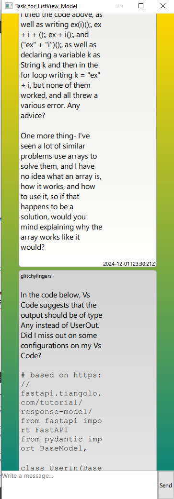

# Задание ListView_Model

## Компоненты

- [main.qml](main.qml)
- [MyDelegate.qml](MyDeligate.qml)
- [PageFooter.qml](PageFooter.qml)

## Примечание

При включении парсера, нельзя писать свои сообщения, так как модель XmlListModel неизменяема.

## Результат

