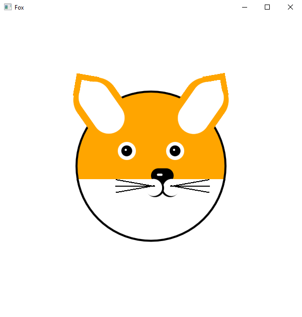
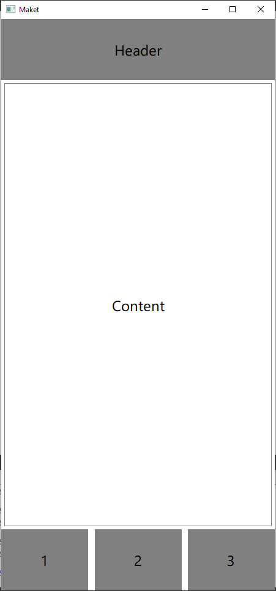

# Задание 1

## Компоненты

- [task1.qml](task1.qml)
- [Head.qml](Head.qml)
- [Ear.qml](Ear.qml)
- [Eye.qml](Eye.qml)
- [Nose.qml](Nose.qml)
- [Mouth.qml](Mouth.qml)
- [Mouthache.qml](Mouthache.qml)

## Результат

--------------------------------------

# Задание 2

## Компоненты

- [task2.qml](task2.qml)
- [Head_obj.qml](Head_obj.qml)
- [Body_obj.qml](Body_obj.qml)
- [Footer_obj.qml](Footer_obj.qml)

## Результат

