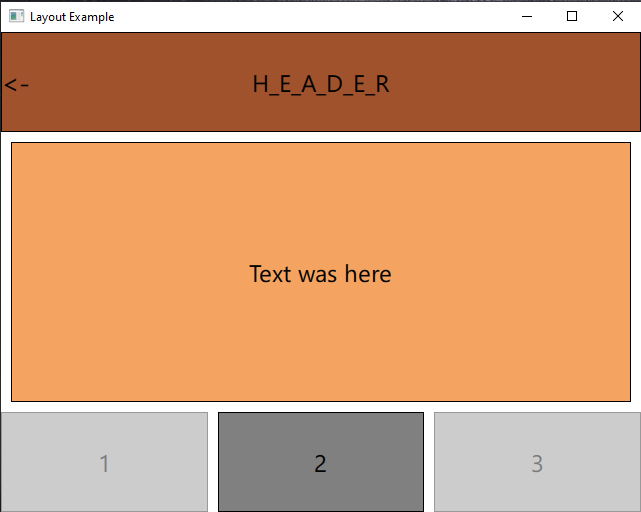

# Задание 1 Светофор

- [main.qml](main.qml)

## Результат

--------------------------------------

# Задание 2

## Компоненты

- [main2.qml](main2.qml)
- [Comp.qml](Comp.qml)

## Результат

Idle

First

Second

Third

